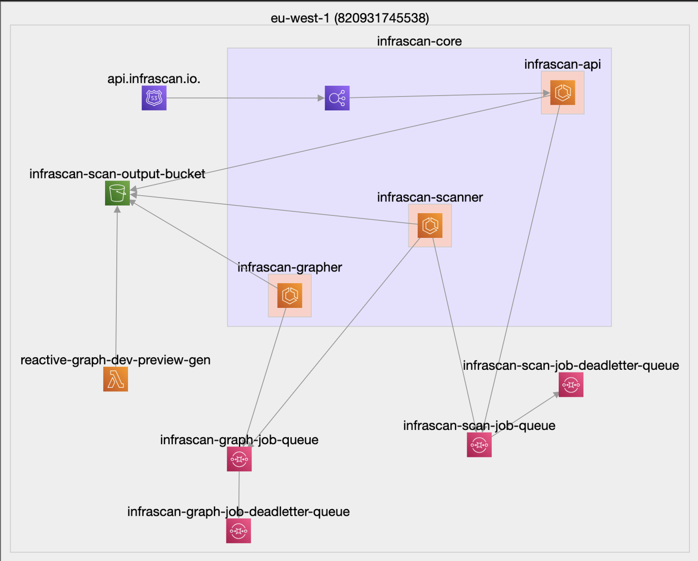

<h1 align="center">Infrascan</h1>

  
  

Infrascan is a set of open-source tools to help you make sense of your cloud infrastructure.

This repo contains the Infrascan SDK, Config, and CLI, as well as private packages used during development.

## Design (wip)

To simplify adding support for additional services, the logic for scanning any one service is encapsulated in a Scanner. Each Scanner implements a `ServiceModule` interface which allows the SDK to create clients for the service, pull state, and generate graph elements.

The standard structure over every scanner also allows the majority of the code to be generated based on a simple config file. The codegen project can be found in the private [@infrascan/codegen package](./aws-scanners/codegen).

## Project Directory

The packages involved in Infrascan development are split across three top-level workspaces: apps, internal and packages. 

### apps
- `render` — a playground for quickly visualizing Infrascan graph outputs, available at [render.infrascan.io](https://render.infrascan.io).

### internal
  - `codegen` — a small [ts-morph](https://github.com/dsherret/ts-morph) project which converts the per service configs from `@infrascan/config` into typescript modules.
  - `shared-types` — a set of type definitions shared across multiple packages
  - `tsconfig` — the base tsconfig definition for the typescript projects in this repo, as recommended by [turbo build](https://turbo.build/repo/docs/handbook/linting/typescript#sharing-tsconfigjson).
  - `eslint-config-custom` — the eslint config for the projects in this repo. Enforces airbnb style guide with some pre-project overrides where relevant.

### packages
  - `cli` — a minimal CLI to scan and graph your infrastructure, saving output to your local FS.
  - `config` — definitions of the per service scanners and graphers, used to generate the SDK.
  - `sdk` — the SDK used to generate scans and graphs of your AWS Infrastructure.
